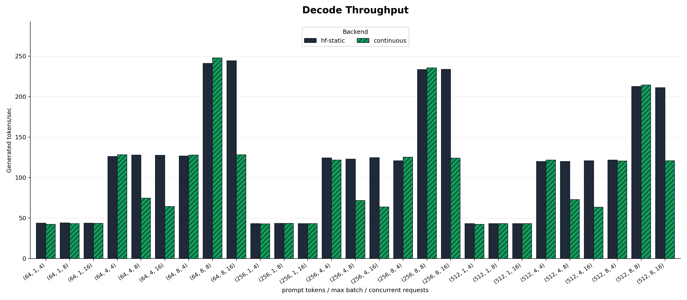
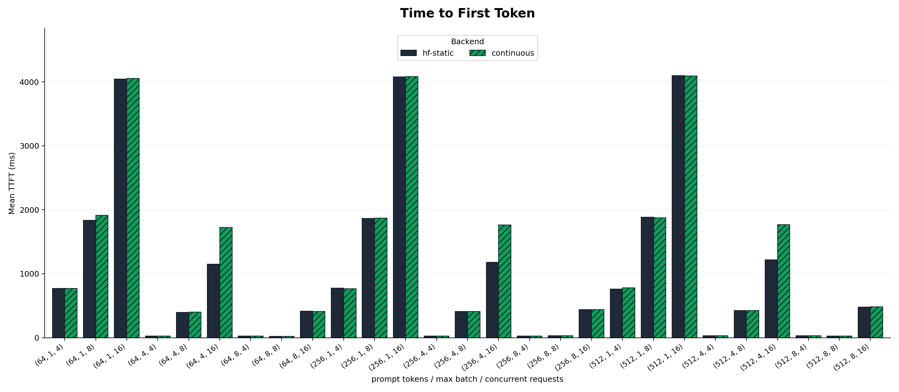
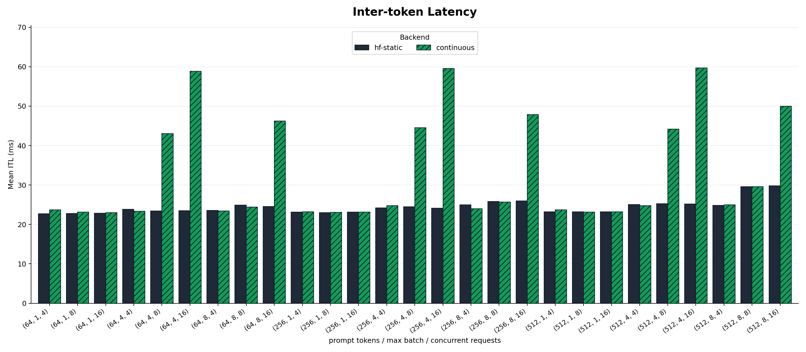
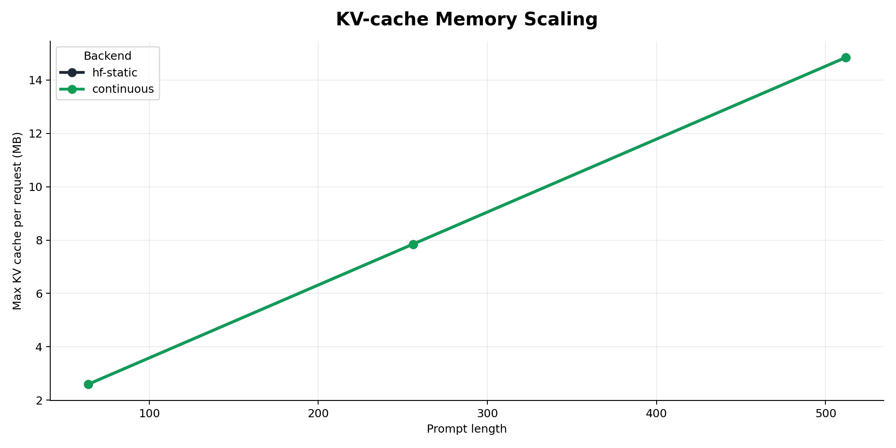
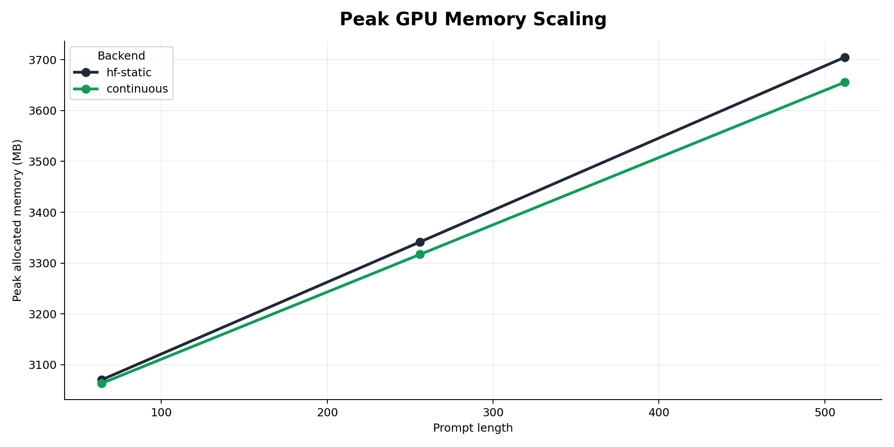

# LLM Inference Benchmarking

Reproducible LLM serving benchmarks for measuring how batching policy changes
latency, throughput, GPU memory use, and KV-cache growth.

The project compares two real PyTorch execution paths:

- `hf-static`: Hugging Face model forward passes with fixed static batches.
- `continuous`: a KV-cache scheduler that admits new requests as soon as batch
  slots open, following the scheduling shape used by vLLM and SGLang-style
  continuous batching. It does not use vLLM or SGLang custom kernels.

Recorded RunPod results are included in `results/` and plotted under `assets/`.

## Install

```bash
uv venv --system-site-packages
uv pip install -e .
```

Use a CUDA PyTorch build that supports the GPU. The recorded benchmark used
PyTorch `2.12.0+cu130`.

## Smoke Test

```bash
./scripts/run_smoke.sh
```

## Full Benchmark

```bash
./scripts/run_runpod_suite.sh
```

Larger model suite:

```bash
./scripts/run_runpod_qwen_1_5b_suite.sh
```

The suites use synthetic token prompts so prompt lengths are exact and
repeatable.

## Benchmark Setup

Results below are generated on RunPod with:

- Hardware: 2x NVIDIA RTX PRO 4000 Blackwell, 24,467 MiB VRAM per GPU
- Driver: 580.159.04
- CUDA runtime reported by PyTorch: 13.0
- PyTorch: `2.12.0+cu130`
- Transformers: `5.10.1`
- Models: `Qwen/Qwen2.5-0.5B-Instruct`, `Qwen/Qwen2.5-1.5B-Instruct`
- Precision: FP16
- Prompt lengths: 64, 256, 512 tokens
- Max batch sizes: 1, 4, 8
- Concurrent request loads: 4, 8, 16
- Per-request decode targets: alternating 16 and 32 generated tokens

The workload uses synthetic token IDs rather than natural-language prompts. This
keeps prompt length exact and makes the run independent of tokenizer quirks.

## Results

Full results:

- Qwen2.5-0.5B: `results/runpod`
- Qwen2.5-1.5B: `results/runpod_qwen_1_5b`

Each result directory contains:

- `benchmark_results.jsonl`
- `benchmark_results.csv`
- `summary.md`
- `request_traces.jsonl`
- `prometheus_metrics.prom`

Representative Qwen2.5-0.5B rows:

| Prompt | Batch | Concurrency | Backend | Tokens/sec | Mean TTFT | Mean ITL | Peak memory | KV/request |
|---:|---:|---:|---|---:|---:|---:|---:|---:|
| 64 | 1 | 16 | hf-static | 50.6 | 3,498.6 ms | 19.8 ms | 1,017 MB | 1.11 MB |
| 64 | 1 | 16 | continuous | 47.5 | 3,779.6 ms | 21.0 ms | 1,017 MB | 1.11 MB |
| 64 | 8 | 8 | hf-static | 281.8 | 23.0 ms | 21.3 ms | 1,137 MB | 1.11 MB |
| 64 | 8 | 8 | continuous | 284.7 | 21.8 ms | 21.1 ms | 1,137 MB | 1.11 MB |
| 64 | 8 | 16 | hf-static | 283.1 | 357.0 ms | 21.1 ms | 1,146 MB | 1.11 MB |
| 64 | 8 | 16 | continuous | 147.9 | 355.9 ms | 40.1 ms | 1,137 MB | 1.11 MB |
| 256 | 4 | 4 | hf-static | 144.1 | 22.5 ms | 20.8 ms | 1,293 MB | 3.36 MB |
| 256 | 4 | 4 | continuous | 145.3 | 21.9 ms | 20.7 ms | 1,293 MB | 3.36 MB |
| 256 | 8 | 8 | hf-static | 277.7 | 23.9 ms | 21.6 ms | 1,604 MB | 3.36 MB |
| 256 | 8 | 8 | continuous | 281.3 | 23.8 ms | 21.4 ms | 1,604 MB | 3.36 MB |
| 512 | 8 | 16 | hf-static | 275.9 | 371.8 ms | 21.8 ms | 2,278 MB | 6.36 MB |
| 512 | 8 | 16 | continuous | 145.1 | 369.6 ms | 40.8 ms | 2,225 MB | 6.36 MB |

Representative Qwen2.5-1.5B rows:

| Prompt | Batch | Concurrency | Backend | Tokens/sec | Mean TTFT | Mean ITL | Peak memory | KV/request |
|---:|---:|---:|---|---:|---:|---:|---:|---:|
| 64 | 8 | 8 | hf-static | 241.2 | 24.2 ms | 24.9 ms | 3,141 MB | 2.60 MB |
| 64 | 8 | 8 | continuous | 248.0 | 24.1 ms | 24.4 ms | 3,141 MB | 2.60 MB |
| 256 | 8 | 8 | hf-static | 233.3 | 31.3 ms | 25.8 ms | 3,633 MB | 7.85 MB |
| 256 | 8 | 8 | continuous | 235.4 | 30.5 ms | 25.7 ms | 3,633 MB | 7.85 MB |
| 512 | 8 | 16 | hf-static | 211.1 | 480.5 ms | 29.8 ms | 4,409 MB | 14.85 MB |
| 512 | 8 | 16 | continuous | 120.7 | 484.4 ms | 50.0 ms | 4,289 MB | 14.85 MB |

Measured ranges:

| Model | Throughput | Mean TTFT | Mean ITL | Peak memory | KV/request |
|---|---:|---:|---:|---:|---:|
| Qwen2.5-0.5B | 46.5-284.7 tok/s | 20.2-3,779.6 ms | 19.7-53.0 ms | 1,005-2,278 MB | 1.11-6.36 MB |
| Qwen2.5-1.5B | 42.1-248.0 tok/s | 24.1-4,100.8 ms | 22.7-59.7 ms | 3,005-4,409 MB | 2.60-14.85 MB |

## Qwen2.5-0.5B Plots


## Qwen2.5-1.5B Plots











## Observations

- Batching dominates throughput. Moving from batch size 1 to batch size 8 raised
  throughput from about 50 tokens/sec to 280+ tokens/sec on Qwen2.5-0.5B, and
  from about 42 tokens/sec to 240+ tokens/sec on Qwen2.5-1.5B.
- TTFT grows with queue depth when concurrency exceeds the active batch capacity.
  For prompt length 512, batch size 8, and concurrency 16, mean TTFT was about
  368 ms on Qwen2.5-0.5B and 480 ms on Qwen2.5-1.5B.
- KV-cache memory scales with prompt length. The measured max KV cache per
  request increased from 1.11 MB to 6.36 MB on Qwen2.5-0.5B, and from 2.60 MB
  to 14.85 MB on Qwen2.5-1.5B.
- The custom continuous scheduler was competitive when active requests stayed
  shape-aligned, for example 248.0 tokens/sec versus 241.2 tokens/sec on
  Qwen2.5-1.5B at prompt 64, batch 8, concurrency 8.
- The custom continuous scheduler lost throughput when request lengths diverged
  and the Python scheduler split active requests into multiple cache-length
  groups.

## References

- Hugging Face: [Continuous batching from first principles](https://huggingface.co/blog/continuous_batching)
- Hugging Face: [Unlocking asynchronicity in continuous batching](https://huggingface.co/blog/continuous_async)
- Hugging Face Transformers: [Continuous batching docs](https://huggingface.co/docs/transformers/main/continuous_batching)
- Hugging Face: [Text Generation Inference docs](https://huggingface.co/docs/text-generation-inference/main/en/index)
