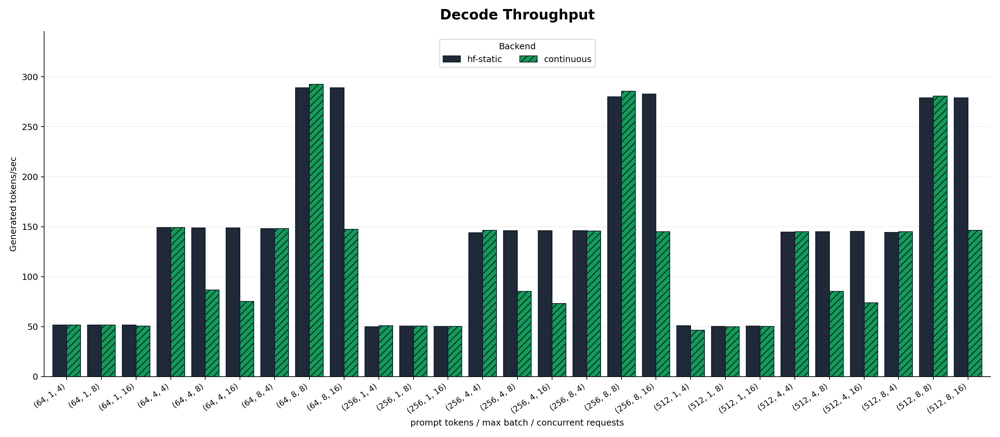
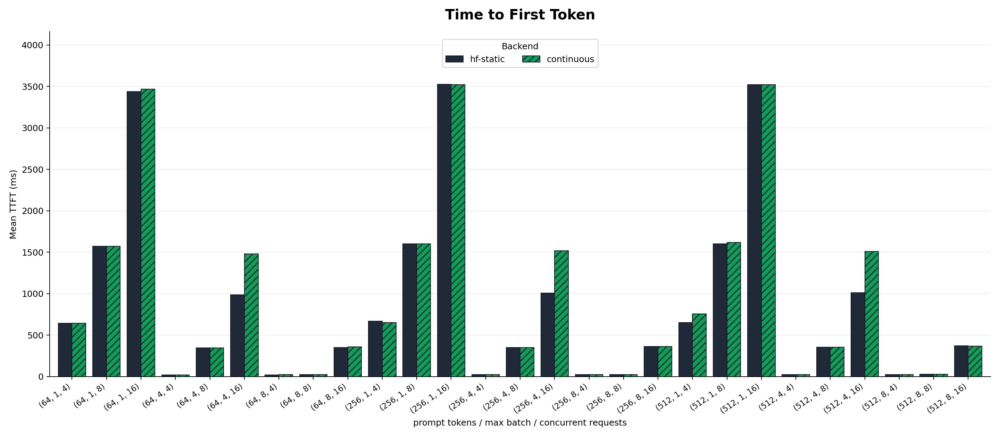
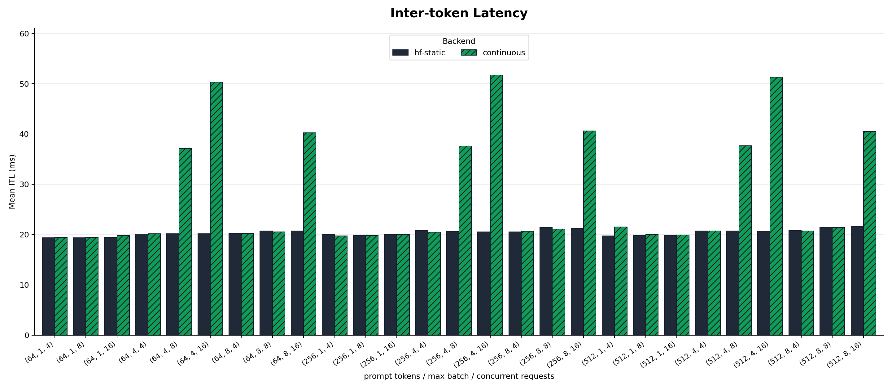
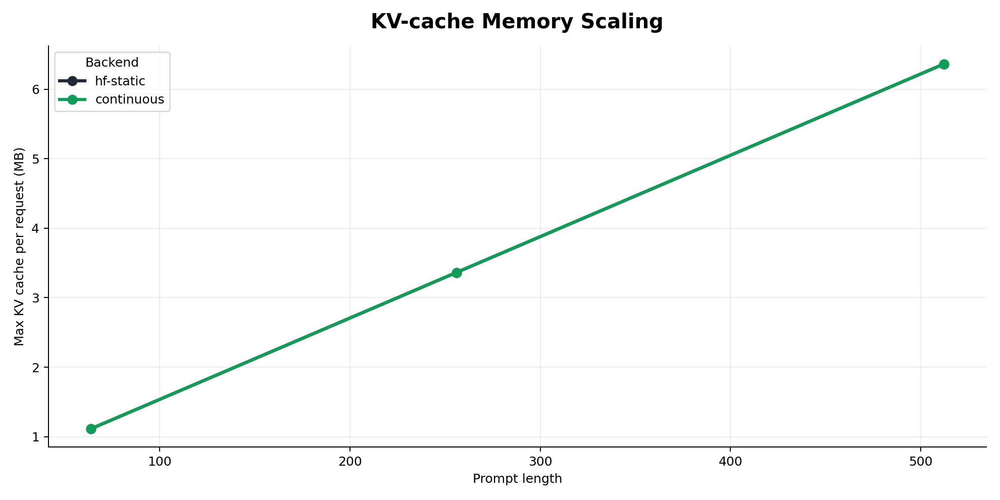
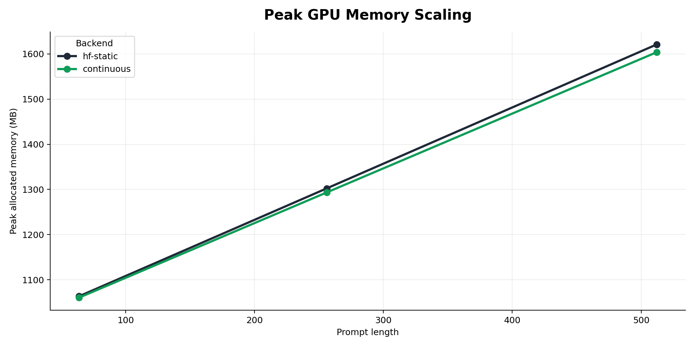

# LLM Inference Benchmarking

Reproducible LLM serving benchmarks for measuring how batching policy changes
latency, throughput, GPU memory use, and KV-cache growth.

The project compares two real PyTorch execution paths:

- `hf-static`: Hugging Face model forward passes with fixed static batches.
- `continuous`: a KV-cache scheduler that admits new requests as soon as batch
  slots open, following the scheduling shape used by vLLM and SGLang-style
  continuous batching. It does not use vLLM or SGLang custom kernels.

Recorded RunPod results are included in `results/runpod` and plotted under
`assets/runpod`.

## Why This Is Useful

The benchmark is meant to answer deployment-oriented questions that come up
before choosing or tuning an inference stack:

- How much throughput do larger active batches buy on a real GPU?
- How quickly does TTFT degrade when concurrent requests exceed the active batch
  capacity?
- How much does KV-cache memory grow as prompt length increases?
- When does a simple continuous-admission scheduler help, and when does its
  Python/cache-management overhead erase the benefit?

This is intentionally not a toy "hello world" generation script. It records
per-workload JSONL/CSV metrics, includes reproducible RunPod commands, measures
latency and memory directly, and keeps the negative results visible.

## Install

```bash
uv venv --system-site-packages
uv pip install -e .
```

Use a CUDA PyTorch build that supports the GPU. The recorded benchmark used
PyTorch `2.12.0+cu130`.

## Smoke Test

```bash
./scripts/run_smoke.sh
```

## Full Benchmark

```bash
./scripts/run_runpod_suite.sh
```

The suite runs `Qwen/Qwen2.5-0.5B-Instruct` with synthetic token prompts so
prompt lengths are exact and repeatable.

## Benchmark Setup

Results below are generated on RunPod with:

- Hardware: 2x NVIDIA RTX PRO 4000 Blackwell, 24,467 MiB VRAM per GPU
- Driver: 580.159.04
- CUDA runtime reported by PyTorch: 13.0
- PyTorch: `2.12.0+cu130`
- Transformers: `5.10.1`
- Model: `Qwen/Qwen2.5-0.5B-Instruct`
- Precision: FP16
- Prompt lengths: 64, 256, 512 tokens
- Max batch sizes: 1, 4, 8
- Concurrent request loads: 4, 8, 16
- Per-request decode targets: alternating 16 and 32 generated tokens

The workload uses synthetic token IDs rather than natural-language prompts. This
keeps prompt length exact and makes the run independent of tokenizer quirks.

## Results

Full results:

- JSONL: `results/runpod/benchmark_results.jsonl`
- CSV: `results/runpod/benchmark_results.csv`
- Markdown table: `results/runpod/summary.md`

Representative rows:

| Prompt | Batch | Concurrency | Backend | Tokens/sec | Mean TTFT | Mean ITL | Peak memory | KV/request |
|---:|---:|---:|---|---:|---:|---:|---:|---:|
| 64 | 1 | 16 | hf-static | 51.5 | 3,437.7 ms | 19.4 ms | 1,017 MB | 1.11 MB |
| 64 | 1 | 16 | continuous | 50.4 | 3,467.2 ms | 19.8 ms | 1,017 MB | 1.11 MB |
| 64 | 8 | 8 | hf-static | 289.1 | 21.8 ms | 20.7 ms | 1,137 MB | 1.11 MB |
| 64 | 8 | 8 | continuous | 292.7 | 21.4 ms | 20.5 ms | 1,137 MB | 1.11 MB |
| 64 | 8 | 16 | hf-static | 289.2 | 351.3 ms | 20.7 ms | 1,146 MB | 1.11 MB |
| 64 | 8 | 16 | continuous | 147.5 | 358.3 ms | 40.2 ms | 1,137 MB | 1.11 MB |
| 256 | 4 | 4 | hf-static | 143.9 | 22.5 ms | 20.8 ms | 1,293 MB | 3.36 MB |
| 256 | 4 | 4 | continuous | 146.5 | 21.8 ms | 20.5 ms | 1,293 MB | 3.36 MB |
| 256 | 8 | 8 | hf-static | 280.0 | 23.4 ms | 21.4 ms | 1,604 MB | 3.36 MB |
| 256 | 8 | 8 | continuous | 285.7 | 23.4 ms | 21.1 ms | 1,604 MB | 3.36 MB |
| 512 | 8 | 16 | hf-static | 279.0 | 368.3 ms | 21.6 ms | 2,278 MB | 6.36 MB |
| 512 | 8 | 16 | continuous | 146.4 | 367.0 ms | 40.5 ms | 2,225 MB | 6.36 MB |

Measured range across all 54 workloads:

- Throughput: 46.3 to 292.7 generated tokens/sec
- Mean TTFT: 20.3 to 3,527.3 ms
- Mean inter-token latency: 19.4 to 51.7 ms
- Peak allocated GPU memory: 1,005 to 2,278 MB
- Max KV cache per request: 1.11 to 6.36 MB

## Plots











## Findings

- Batching dominates throughput. Moving from batch size 1 to batch size 8 raised
  throughput from about 50 tokens/sec to about 280-293 tokens/sec on this model.
- TTFT grows with queue depth when concurrency exceeds the active batch capacity.
  For prompt length 512, batch size 8, and concurrency 16, mean TTFT was about
  368 ms because half the requests waited for the first wave.
- KV-cache memory scales with prompt length. The measured max KV cache per
  request increased from 1.11 MB at 64 prompt tokens to 6.36 MB at 512 prompt
  tokens.
- The custom continuous scheduler was competitive when active requests stayed
  shape-aligned, for example 292.7 tokens/sec versus 289.1 tokens/sec at prompt
  64, batch 8, concurrency 8.
- The custom continuous scheduler lost throughput when request lengths diverged
  and the Python scheduler split active requests into multiple cache-length
  groups. That is an implementation finding, not an indictment of production
  continuous batching systems.

## Notes

The benchmark intentionally separates scheduling behavior from specialized
serving kernels. This makes the experiment small enough to reproduce on a
single RunPod container while still measuring the core deployment tradeoff:
static batches keep execution simple, while continuous admission reduces queue
waiting when requests have uneven decode lengths.

Production serving stacks add optimizations this benchmark does not implement:
paged attention, chunked prefill, CUDA graph capture, async CPU/GPU scheduling,
request streaming, and production metrics. The README therefore reports this as
a Hugging Face/PyTorch scheduler benchmark, not as a replacement for vLLM,
SGLang, or Hugging Face TGI.

## References

- Hugging Face: [Continuous batching from first principles](https://huggingface.co/blog/continuous_batching)
- Hugging Face: [Unlocking asynchronicity in continuous batching](https://huggingface.co/blog/continuous_async)
- Hugging Face Transformers: [Continuous batching docs](https://huggingface.co/docs/transformers/main/continuous_batching)
- Hugging Face: [Text Generation Inference docs](https://huggingface.co/docs/text-generation-inference/main/en/index)
